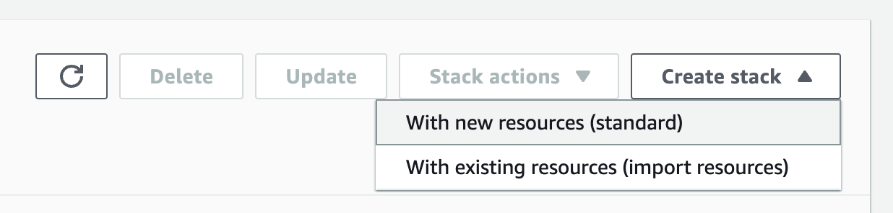
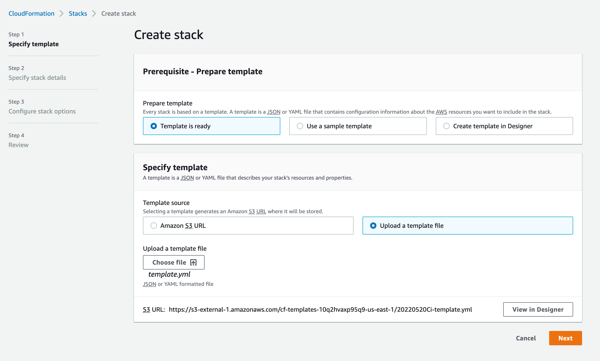
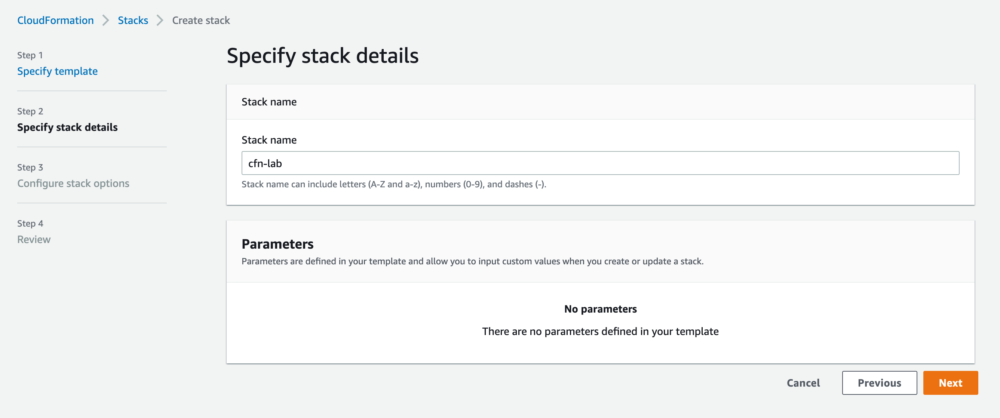
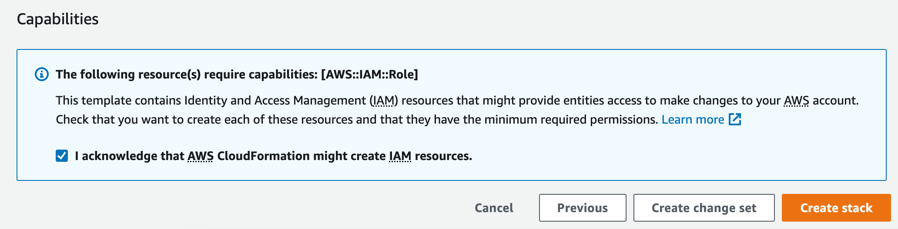
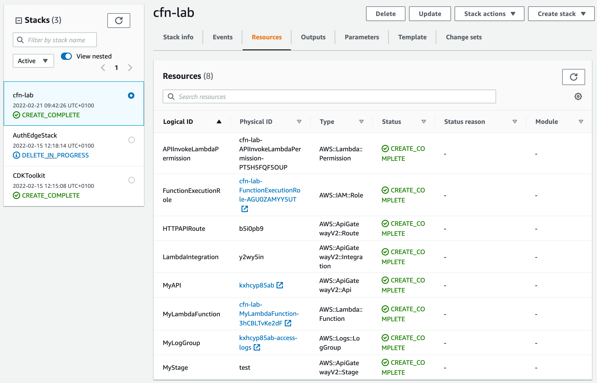
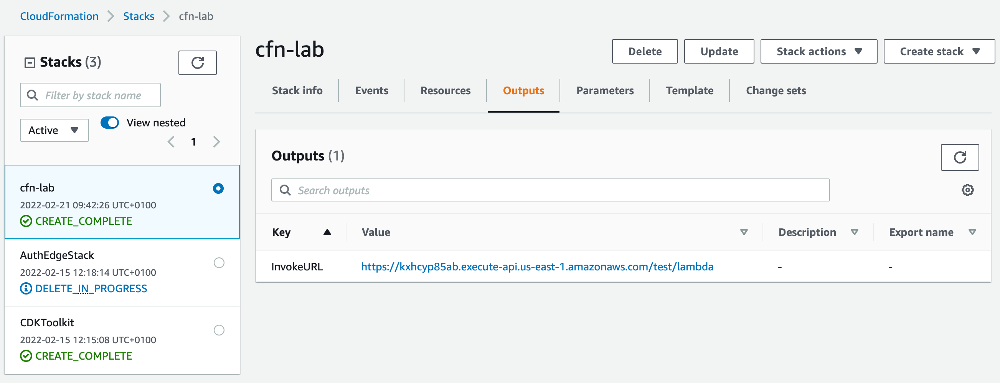

# cloudformation-lab
CloudFormation Lab for CDK Immersion Day

## Instructions

### Creating the Stack
1. Download the [CloudFormation template](template.yml) from this repository.
2. Open the template file and read through it.
3. Go to the CloudFormation console and click "Create Stack -> with new resources" 
4. Upload the CloudFormation template. 
5. Enter "cfn-lab" as the Stack name and hit next. 
6. On the next page, leave everything default and click next.
7. On the final page, scroll to the bottom, acknowledge the checkbox and hit "Create stack" 

### Reviewing the Stack
1. Open the just created stack in CloudFormation and click on resources. Review all the resources that have been created. 
2. Click on outputs to find the query url and click on it. 
